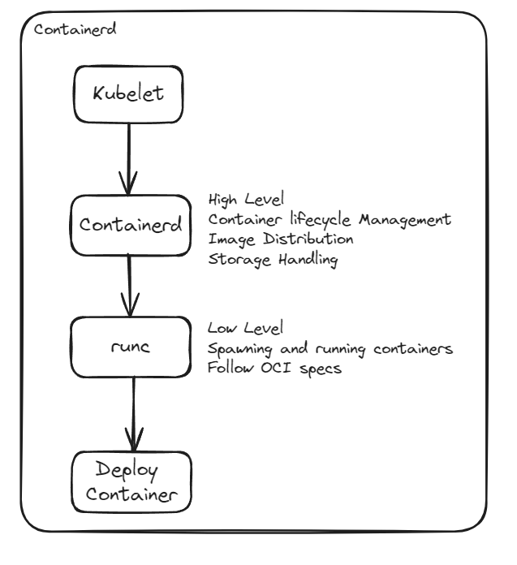

# Kubeadm

<aside>
👉🏾 kubeadm perform the actions necessary to get a minimum viable cluster up and running.

But design - Only bootstrap - no provisioning of machine

Installing various nice to have addons.

</aside>

`become: true`

# Installation of kubeadm

#Ref Link: [https://kubernetes.io/docs/setup/production-environment/tools/kubeadm/install-kubeadm/](https://kubernetes.io/docs/setup/production-environment/tools/kubeadm/install-kubeadm/)

## Pre-Requisite

- Compatible Linux host
- 2 GB or more RAM
- 2 CPUs or more
- Full network connectivity between all machine in the cluster
- Unique hostname, MAC address and product_uuid for every node
    
    ```bash
    hostnamectl set-hostname <hostname>
    ```
    
- Swap configuration → By default `kubelet` fails if swap memory was detected on a node.
    
    ```bash
    #Will disable swapping temporarily.
    sudo swapoff -a
    #To permanently disable swap
    sudo sed -i '/\s\+swap\s\+/s/^\(.*\)$/#\1/g' /etc/fstab
    ```
    

### Installing Kubeadm

ref link: [https://kubernetes.io/docs/setup/production-environment/tools/kubeadm/install-kubeadm/](https://kubernetes.io/docs/setup/production-environment/tools/kubeadm/install-kubeadm/)

## Required Ports

#Ref Link: [https://kubernetes.io/docs/reference/networking/ports-and-protocols/](https://kubernetes.io/docs/reference/networking/ports-and-protocols/)

### **Control plane**

| Protocol | Direction | Port Range | Purpose | Used By |
| --- | --- | --- | --- | --- |
| TCP | Inbound | 6443 | Kubernetes API server | All |
| TCP | Inbound | 2379-2380 | etcd server client API | kube-apiserver, etcd |
| TCP | Inbound | 10250 | Kubelet API | Self, Control plane |
| TCP | Inbound | 10259 | kube-scheduler | Self |
| TCP | Inbound | 10257 | kube-controller-manager | Self |

### **Worker nodes**

| Protocol | Direction | Port Range | Purpose | Used By |
| --- | --- | --- | --- | --- |
| TCP | Inbound | 10250 | Kubelet API | Self, Control plane |
| TCP | Inbound | 10256 | kube-proxy | Self, Load balancers |
| TCP | Inbound | 30000-32767 | NodePort Services† | All |

# Installing Container Runtime

To run a container in pods, k8s uses a container runtime

#Red Link: [https://kubernetes.io/docs/setup/production-environment/container-runtimes/](https://kubernetes.io/docs/setup/production-environment/container-runtimes/)

You need to install a container runtime into each node in the cluster so that Pods can run there.

## Containerd

#Ref Link: [https://github.com/containerd/containerd/blob/main/docs/getting-started.md](https://github.com/containerd/containerd/blob/main/docs/getting-started.md)

## Prerequisites

### Step 1: Installing containerd - Binary

```bash
wget https://github.com/containerd/containerd/releases/download/v1.7.15/containerd-1.7.15-linux-amd64.tar.gz
tar Cxzvf /usr/local containerd-1.7.15-linux-amd64.tar.gz
rm -f containerd-1.7.15-linux-amd64.tar.gz
```

### systemd

```bash
sudo wget -P /usr/local/lib/systemd/system/ https://raw.githubusercontent.com/containerd/containerd/main/containerd.service
```

```bash
systemctl daemon-reload
systemctl enable --now containerd
```

### Step 2: Installing runc

It is responsible for creating and managing the container execution environment, including setting up namespace, control groups(cgroup) and executing the containerized process.

It is the low level component that directly interact with the linux kernel to run containers.

```bash
wget https://github.com/opencontainers/runc/releases/download/v1.1.12/runc.amd64
install -m 755 runc.amd64 /usr/local/sbin/runc
```

### Step 3: Install CNI (Container network interface) plugins

```bash
wget https://github.com/containernetworking/plugins/releases/download/v1.4.1/cni-plugins-linux-amd64-v1.4.1.tgz

mkdir -p /opt/cni/bin
tar Cxzvf /opt/cni/bin cni-plugins-linux-amd64-v1.4.1.tgz
rm -f cni-plugins-linux-amd64-v1.4.1.tgz
```

### Step 4: Installing `crictl`

Interacting with containerd via CLI. This is the alternate of `docker` command.

`crictl` has the exact commands and options as like `docker`

Commands Eg: `ps` `image` `logs` `rm`

```bash
VERSION="v1.26.0" # check latest version in /releases page
wget https://github.com/kubernetes-sigs/cri-tools/releases/download/$VERSION/crictl-$VERSION-linux-amd64.tar.gz
sudo tar zxvf crictl-$VERSION-linux-amd64.tar.gz -C /usr/local/bin
rm -f crictl-$VERSION-linux-amd64.tar.gz
```

The endpoint can be set in three ways:

- By setting global option flags `-runtime-endpoint` (`r`) and `-image-endpoint` (`i`)
- By setting environment variables `CONTAINER_RUNTIME_ENDPOINT` and `IMAGE_SERVICE_ENDPOINT`
- By setting the endpoint in the config file `-config=/etc/crictl.yaml`

```bash
cat <<EOF | sudo tee /etc/crictl.yaml
runtime-endpoint: unix:///run/containerd/containerd.sock
image-endpoint: unix:///run/containerd/containerd.sock
timeout: 2
debug: false
pull-image-on-create: false
EOF
```

### Enabling IPv4 packet forwarding

- Pod to pod communication
    - Pods may need to communicate with each other, regardless of which node they are running on. Enabling packet forwarding allow pods on different nodes to communicate directly, without needing to route traffic through external device.
- Service load balancing:
    - Packet forwarding enables the routing of traffic from external clients to the appropriate pods even if those pods are running on different nodes.
- Internal Load balancing:
    - K8s cluster often have internal services or components that need to communicate with each other.
    - Packet forwarding facilitates the routing of traffic between these internal services, improving overall cluster communication and performance.
- Network Policies:
    - Allow admins to define rules for how pods can communicate with each other and with external resources.
- Overlay Networking:
    - K8s use over networks to provide network connectivity b/w pods running on different nodes.
- Service mesh:
    - Istio, Linkerd- Enhance communication b/w microservice in k8s clusters.

<aside>
👉🏾 When creating a Kubernetes cluster using Amazon Elastic Kubernetes Service (EKS), you typically don't need to manually configure packet forwarding or handle low-level networking tasks like you might when setting up a Kubernetes cluster from scratch or managing your own cluster.

</aside>

```bash
# sysctl params required by setup, params persist across reboots
cat <<EOF | sudo tee /etc/sysctl.d/k8s.conf
net.ipv4.ip_forward = 1
EOF

# Apply sysctl params without reboot
sudo sysctl --system
```

## Cgroup Drivers

Control groups are used to constrain resources that are allocated to processes.

Both the kubelet and the container runtime need to interface with control groups to enforce resource management for pods and containers and set resources such as cpu/memory requests and limits.

2 cgroup driver available:

1. cgroupfs  → Default cgroup driver in the kubelet.
2. systemd → 
    1. **`containerd`** is a higher-level container runtime that builds on top of **`runc`**.
    2. It provides a more comprehensive container runtime environment, including features like image management, storage management, and container lifecycle management.

### Use of Cgroup Driver by Containerd:

1. Resource Management
    1. CPU, memory, and IO limits, as well as prioritization and accounting.
    2. Containerd can ensure that containers receive their allocated resources efficiently and fairly.
2. Isolation
    1. For ensuring that containers do not interfere with each other and that applications running within containers remain isolated from the host system and other containers.
3. Integration with system services
    1. By integrating container runtimes with systemd cgroups, containers can be treated more like native systemd services. This integration allows for better coordination between containers and system services, simplifying management and monitoring.
4. Consistency and standardization
    1. It leverages existing infrastructure and tools, making it easier to manage containers in environments where systemd is already in use.

## Configuring the `systemd` cgroup driver

```bash
#Path: /etc/containerd/config.toml

mkdir /etc/containerd

echo "[plugins."io.containerd.grpc.v1.cri".containerd.runtimes.runc]
  [plugins."io.containerd.grpc.v1.cri".containerd.runtimes.runc.options]
    SystemdCgroup = true" > /etc/containerd/config.toml
```



### OCI Runtime Spec:

The OCI Runtime Spec defines the behavior and the configuration interface of low-level container runtimes such as [runc](https://github.com/opencontainers/runc). These low-level container runtimes are usually called from high-level container runtimes such as [containerd](https://containerd.io/) and [CRI-O](https://cri-o.io/).

```bash
#Start the service
sudo systemctl daemon-reload
sudo systemctl enable containerd
sudo systemctl start containerd
```

# Installing Kubeadm, kubelet and kubectl

`kubeadm` → The command to bootstrap the cluster

`kubelet` → The component that runs on all of the machines in your cluster and does things like starting pods and containers.

`kubectl` → Command to talk to cluster

```bash
# Set SELinux in permissive mode (effectively disabling it)
sudo setenforce 0
sudo sed -i 's/^SELINUX=enforcing$/SELINUX=permissive/' /etc/selinux/config
```

```bash
# This overwrites any existing configuration in /etc/yum.repos.d/kubernetes.repo
cat <<EOF | sudo tee /etc/yum.repos.d/kubernetes.repo
[kubernetes]
name=Kubernetes
baseurl=https://pkgs.k8s.io/core:/stable:/v1.30/rpm/
enabled=1
gpgcheck=1
gpgkey=https://pkgs.k8s.io/core:/stable:/v1.30/rpm/repodata/repomd.xml.key
exclude=kubelet kubeadm kubectl cri-tools kubernetes-cni
EOF
```

Install `kubeadm`, `kubelet` and add a `kubelet` systemd service:

```bash
sudo yum install -y kubelet kubeadm kubectl --disableexcludes=kubernetes
```

```bash
sudo systemctl enable --now kubelet
```

## **Run on Master Node and follow the instructions**

#Ref Link : [https://www.mankier.com/1/kubeadm-init](https://www.mankier.com/1/kubeadm-init)

```bash
kubeadm config images pull
kubeadm init
```

## Post Installation of Kubeadm in all nodes.

Copy, paste the commands it outputs in the control node to configure the kubeadm config files.

Once Initializing the control node with the kubeadm, being an user you access the kube config file. Or you get a error that `The connection to the server localhost:8080 was refused`

```bash
  mkdir -p $HOME/.kube
  sudo cp -i /etc/kubernetes/admin.conf $HOME/.kube/config
  sudo chown $(id -u):$(id -g) $HOME/.kube/config

```

If being the root user use this,

```bash
export KUBECONFIG=/etc/kubernetes/admin.conf
```

<aside>
👉🏾 When a control node is restarted, you need to again specify the above steps to access the kubeadm. Or you will get error.

</aside>

## Weave Net

### Ports to be open for Weave Net

#Ref Link: [https://rajch.github.io/weave/install/using-weave](https://rajch.github.io/weave/install/using-weave)

| Protocol | Port Range | Use |
| --- | --- | --- |
| TCP | 6783 | Weave’s Control |
| UDP | 6783-6784 | Data Ports |

### Installing the weave net

```bash
kubectl apply -f https://reweave.azurewebsites.net/k8s/v1.29/net.yaml
```

When passing the IP address `--pod-network-cidr` during the `kubeadm init` command. 
You need to make sure it matches the IPALLOC_RANGE given to weaver net.

To edit the weave net `.YAML` file

```bash
kubectl edit ds(deamon set) <deamon_name> -n <namespace>
```

Added the `env` ⇒  `IPALLOC_RANGE` in the `.YAML` file

## CRI -Container Runtime Interface

CRI consists of a specifications/requirements, protobuf API and libs for container runtimes to integrate with kubelet on a node, 

<aside>
👉🏾 To reset the whole kubeadm using the command `kubeadm reset`

</aside>

# Types of Deployments

### Canary Deployment

Releasing a new version of an application to a small subset of users or servers often referred to as the canary group.

 Small percentage of users first to gauge its impact and gather feedback before rolling it out to everyone.

### Blue Green Deployment

- Involves running two identical production environments (blue and green).
- One environment serves live traffic (blue), while the other is inactive (green).
- New versions are deployed to the inactive environment (green), and once verified, traffic is switched from the blue to the green environment, making it live.

### Rolling Deployment

- Involves gradually updating instances of an application, one at a time, with the new version.
- Each instance is updated while the rest continue to serve traffic.
- This approach ensures that the application remains available throughout the deployment process and minimizes downtime.

### A/B Testing

- Involves releasing multiple versions of an application or feature simultaneously to different user groups.
- User behavior and feedback are analyzed to determine which version performs better in terms of metrics such as engagement, conversion rates, etc.
- This approach helps in making data-driven decisions about which version to roll out to the entire user base.